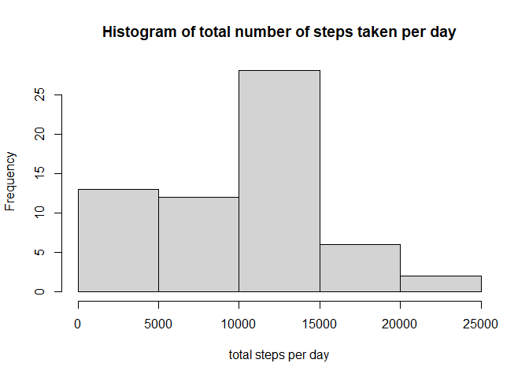
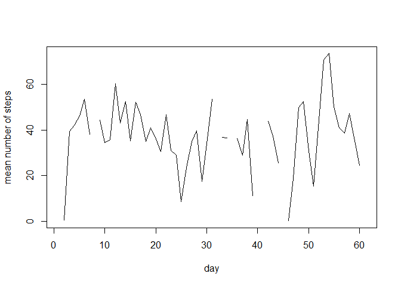
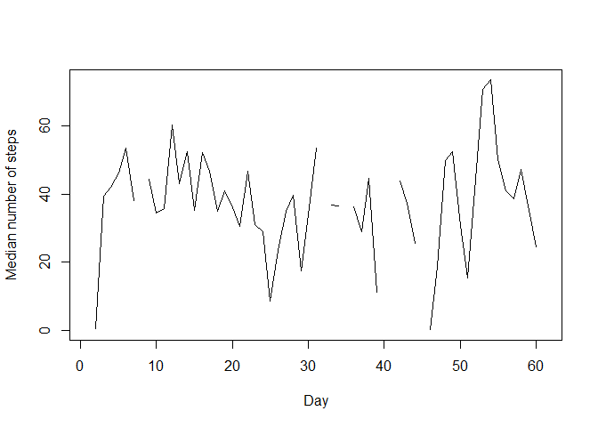
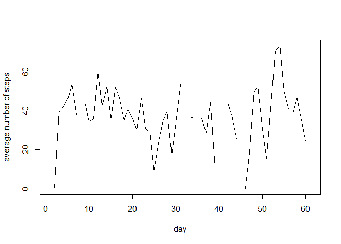
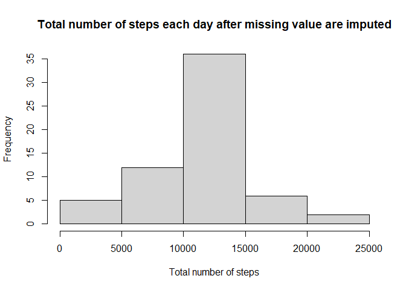
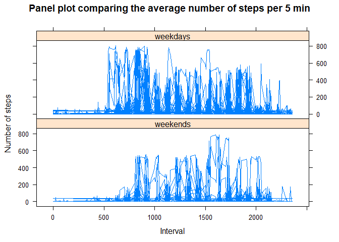

## Loading and preprocessing the data

```r
fileUrl<-"https://d396qusza40orc.cloudfront.net/repdata%2Fdata%2Factivity.zip "
download.file(fileUrl,destfile = ".\\activity_monitoring.zip",mode='wb',cacheOK = FALSE)

unzip("activity_monitoring.zip",exdir=getwd())
data<-read.csv("activity.csv")
```


## What is mean total number of steps taken per day?

```r
    sumByday<-tapply(data$steps, data$date, sum,na.rm=TRUE)
    hist(sumByday,
         main="Histogram of total number of steps taken per day",
         xlab="total steps per day")
```

<!-- -->

## What is the average daily activity pattern? 

The mean number of steps taken each day are    

```r
    meanSteps<-tapply(data$steps, data$date, mean,na.rm=TRUE)
    
    plot(meanSteps,type="l",
         ylab="mean number of steps",
         xlab="day")
```

<!-- -->

The median number of steps taken each day are    

```r
    medianSteps<-tapply(data$steps, data$date, median,na.rm=TRUE)
    
    plot(meanSteps,type="l",
         ylab="Median number of steps",
         xlab="Day")
```

<!-- -->
    
Time series plot of the average number of steps taken

```r
    meanPerDay<-tapply(data$steps,data$date,mean,na.rm=TRUE)
    plot(meanPerDay,type="l",
         ylab="average number of steps",
         xlab="day")
```

<!-- -->

The 5-minute interval that, on average, contains the maximum number of steps

```r
    data[which.max(data$steps),]
```

```
##       steps       date interval
## 16492   806 2012-11-27      615
```


The maximum steps per 5 minutes on average is on


```r
    which.max(meanPerDay)
```

```
## 2012-11-23 
##         54
```

## Imputing missing values

```r
#number of NA values , either a whole day is NA or there's no NA in that day
#replace NA value with the mean of all the non-NA steps in 5 min interval

naRow<-which(is.na(data$steps))

meanTotal<-mean(data$steps,na.rm=TRUE)
dataImputed<-data

naTotal<-sum(is.na(dataImputed$steps))
dataImputed[which(is.na(data$steps)),1]<-meanTotal


for (i in naRow){
    if (is.na(meanSteps[dataImputed[i,2]])){
        dataImputed[i,1]<-meanTotal
    } else {
        
        dataImputed[i,1]<-meanSteps[dataImputed[i,2]]
    
    }
}
```


Histogram of the total number of steps taken each day after missing values are imputed

```r
    sumBydayIm<-tapply(dataImputed$steps, dataImputed$date, sum,na.rm=TRUE)
    hist(sumBydayIm,
         main="Total number of steps each day after missing value are imputed", 
         xlab="Total number of steps")
```

<!-- -->


## Are there differences in activity patterns between weekdays and weekends?

The number of data points on weekdays is more than on weekends, but it seems on average, the number of steps on weekdays are more than on weekends.

```r
dataImputed$date<-as.Date(dataImputed$date)
weekend <- c('Saturday', 'Sunday')
dataImputed$wDay<-factor((weekdays(dataImputed$date) %in% weekend),levels<-c(TRUE,FALSE),labels=c('weekends','weekdays'))
#table(dataImputed$wDay)
library(lattice)
xyplot(dataImputed$steps~dataImputed$interval|dataImputed$wDay,type = "l",
          main="Panel plot comparing the average number of steps per 5 min",
          xlab="Interval",
          ylab="Number of steps",
          layout=c(1,2))
```

<!-- -->


## Write to HTML file

